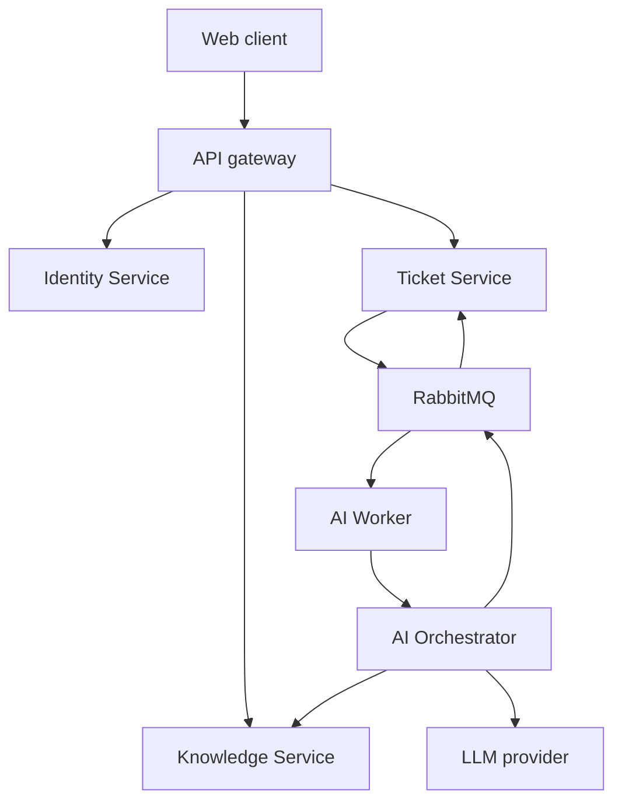

# System Architecture

## 1. Architectural style

The platform uses independently deployable services with database-per-service ownership. Synchronous REST is used for user-facing reads/commands that require an immediate response. RabbitMQ is used for long-running AI work and domain-event propagation.

AI is isolated behind AI Orchestrator so Ticket Service never depends directly on an LLM SDK. Knowledge retrieval is isolated because it has a separate data lifecycle, vector index and authorization model.

## 2. Logical components

## 3. Service boundaries

### Identity Service

Owns user credentials, roles, sessions and token revocation. It does not own business profiles, tickets or knowledge permissions beyond identity claims.

### Ticket Service

System of record for ticket workflow. It owns current ticket state and a projection of AI results needed by the UI. It must not contain provider-specific prompt or SDK code.

### AI Orchestrator Service

Owns AI jobs, prompt templates, provider calls, output validation, usage records and user feedback. It must not update ticket tables directly.

### Knowledge Service

Owns knowledge documents, ingestion status, chunks, embeddings, ACL metadata and semantic search. It never generates the final reply.

### AI Worker

Consumes events, calls service APIs and publishes result events. It is stateless apart from Redis leases/idempotency keys. Business state remains in owning services.

## 4. Communication matrix

| Caller | Callee | Mode | Purpose | Timeout | Retry |
|---|---|---|---|---:|---|
| Client | Gateway/services | REST | User commands and queries | 15 s | client-controlled for safe GET only |
| Worker | AI Orchestrator | REST | Execute an AI job | 60 s | 2 with exponential backoff |
| AI Orchestrator | Knowledge Service | REST | Retrieve grounded context | 3 s | 1 |
| AI Orchestrator | LLM provider | SDK/HTTPS | Structured generation | 30 s | 2 for retryable errors |
| Services | RabbitMQ | event | Domain/result propagation | async | broker redelivery + DLQ |

No service may perform a synchronous call inside a database transaction.

## 5. Data ownership rules

- A service reads another service's data only through a published API or event.
- Cross-database joins are prohibited.
- Ticket Service stores `ai_analysis_id`, selected fields and presentation snapshot, not AI prompt internals.
- AI Orchestrator stores ticket text snapshots only as long as required for audit; default 30 days.
- Knowledge Service returns citation identifiers and excerpts only after tenant and ACL filtering.

## 6. Reliability patterns

### Transactional outbox

Ticket Service writes the ticket change and outbox row in the same transaction. A publisher job claims unpublished rows using `FOR UPDATE SKIP LOCKED`, publishes them and marks them published.

### Idempotent consumer

Each consumer inserts `(consumer_name, event_id)` into `processed_event`. A unique constraint ensures one logical application. Business changes and processed marker are committed atomically.

### Circuit breaker

AI Orchestrator opens the provider circuit after 50% failures in a 20-call sliding window, minimum 10 calls. Open duration is 30 seconds. During open state, jobs become `RETRY_SCHEDULED`; core APIs remain healthy.

### Dead-letter handling

After five broker deliveries, route messages to a service-specific DLQ. Alert when any DLQ contains messages for more than five minutes. Replay requires an operator command with original event ID preserved.

## 7. Deployment topology

Minimum production topology:

- Two instances each for stateless REST services behind a load balancer.
- Two Worker instances with configurable concurrency.
- Managed PostgreSQL with separate database and credential per service.
- Managed RabbitMQ with durable quorum queues.
- Redis with persistence disabled unless used for durable functions.
- S3-compatible versioned bucket with server-side encryption.
- Central OpenTelemetry Collector.

## 8. Architecture decisions

| Decision | Choice | Rationale |
|---|---|---|
| AI framework | Spring AI behind an internal adapter | Matches Java/Spring skill set and prevents provider leakage |
| Vector store | PostgreSQL + pgvector | Low operational overhead and familiar SQL tooling |
| Async broker | RabbitMQ | Clear routing/retry/DLQ semantics for portfolio scale |
| Consistency | Eventual for AI results | AI is non-critical and long-running |
| Token format | RS256 JWT | Services verify without sharing signing secret |
| API errors | RFC 9457-style problem JSON | One machine-readable error format |

