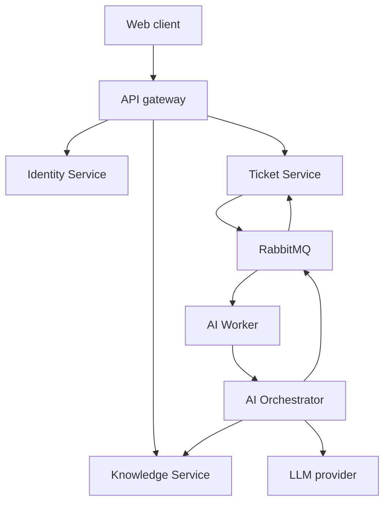

# Kiến trúc hệ thống

## 1. Phong cách kiến trúc

Nền tảng gồm các service có thể triển khai độc lập, mỗi service sở hữu database riêng. REST đồng bộ
được dùng cho thao tác đọc/lệnh từ người dùng cần phản hồi ngay. RabbitMQ được dùng cho tác vụ AI
chạy lâu và truyền domain event.

AI được cô lập sau AI Orchestrator để Ticket Service không phụ thuộc trực tiếp vào SDK của LLM.
Knowledge Service được tách riêng vì có vòng đời dữ liệu, vector index và mô hình phân quyền riêng.

## 2. Các thành phần logic

```mermaid
flowchart TD
  Client[Web client] --> Gateway[API gateway]
  Gateway --> Identity[Identity Service]
  Gateway --> Ticket[Ticket Service]
  Gateway --> Knowledge[Knowledge Service]
  Ticket --> Broker[RabbitMQ]
  Broker --> Worker[AI Worker]
  Worker --> AI[AI Orchestrator]
  AI --> Knowledge
  AI --> Provider[LLM provider]
  AI --> Broker
  Broker --> Ticket
```

## 3. Ranh giới service

### Identity Service

Sở hữu thông tin đăng nhập, role, session và thu hồi token. Service này không sở hữu business
profile, ticket hay quyền truy cập knowledge ngoài các identity claim.

### Ticket Service

Là nguồn dữ liệu chuẩn cho quy trình ticket. Service sở hữu trạng thái hiện tại của ticket và bản
chiếu kết quả AI cần cho UI. Không được chứa prompt hoặc mã SDK riêng của nhà cung cấp AI.

### AI Orchestrator Service

Sở hữu AI job, prompt template, lời gọi provider, kiểm tra output, usage record và phản hồi người
dùng. Không được cập nhật trực tiếp bảng của Ticket Service.

### Knowledge Service

Sở hữu tài liệu, trạng thái ingest, chunk, embedding, metadata ACL và semantic search. Service này
không sinh câu trả lời cuối cùng.

### AI Worker

Nhận event, gọi API của các service và phát result event. Worker không giữ trạng thái ngoài Redis
lease/idempotency key; business state luôn nằm tại service sở hữu.

## 4. Ma trận giao tiếp

| Bên gọi | Bên nhận | Cách gọi | Mục đích | Timeout | Retry |
|---|---|---|---|---:|---|
| Client | Gateway/services | REST | Lệnh và truy vấn của người dùng | 15 s | client chỉ retry GET an toàn |
| Worker | AI Orchestrator | REST | Thực thi AI job | 60 s | 2 lần, exponential backoff |
| AI Orchestrator | Knowledge Service | REST | Lấy ngữ cảnh có căn cứ | 3 s | 1 lần |
| AI Orchestrator | LLM provider | SDK/HTTPS | Sinh output có cấu trúc | 30 s | 2 lần với lỗi cho phép retry |
| Services | RabbitMQ | event | Truyền domain/result event | async | broker redelivery + DLQ |

Không service nào được gọi đồng bộ sang service khác khi đang giữ database transaction.

## 5. Quy tắc sở hữu dữ liệu

- Service chỉ đọc dữ liệu của service khác qua API hoặc event đã công bố.
- Cấm join xuyên database.
- Ticket Service lưu `ai_analysis_id`, các field đã chọn và snapshot trình bày, không lưu nội bộ
  prompt của AI.
- AI Orchestrator chỉ giữ snapshot nội dung ticket trong thời gian cần cho audit; mặc định 30 ngày.
- Knowledge Service chỉ trả citation ID và excerpt sau khi lọc tenant và ACL.

## 6. Mẫu thiết kế bảo đảm độ tin cậy

### Transactional outbox

Ticket Service ghi thay đổi ticket và outbox row trong cùng transaction. Publisher claim các row
chưa phát bằng `FOR UPDATE SKIP LOCKED`, gửi chúng rồi đánh dấu đã phát.

### Idempotent consumer

Mỗi consumer chèn `(consumer_name, event_id)` vào `processed_event`. Unique constraint bảo đảm một
event chỉ được áp dụng logic một lần. Business change và processed marker được commit nguyên tử.

### Circuit breaker

AI Orchestrator mở circuit của provider khi tỷ lệ lỗi đạt 50% trong sliding window 20 lần gọi, tối
thiểu 10 lần. Circuit mở 30 giây. Trong thời gian này job chuyển thành `RETRY_SCHEDULED`, còn core API
vẫn hoạt động bình thường.

### Xử lý dead letter

Sau năm lần broker delivery, message được chuyển tới DLQ riêng của service. Cảnh báo nếu DLQ có
message quá năm phút. Replay cần lệnh của operator và phải giữ nguyên event ID ban đầu.

## 7. Mô hình triển khai

Mô hình production tối thiểu:

- Hai instance cho mỗi stateless REST service sau load balancer.
- Hai Worker instance với concurrency có thể cấu hình.
- PostgreSQL được quản lý, database và credential tách riêng theo service.
- RabbitMQ được quản lý với durable quorum queue.
- Redis tắt persistence nếu không dùng cho chức năng cần độ bền dữ liệu.
- Bucket tương thích S3, bật versioning và mã hóa phía server.
- OpenTelemetry Collector tập trung.

## 8. Các quyết định kiến trúc

| Quyết định | Lựa chọn | Lý do |
|---|---|---|
| AI framework | Spring AI sau internal adapter | Phù hợp kỹ năng Java/Spring và không để lộ provider vào nghiệp vụ |
| Vector store | PostgreSQL + pgvector | Chi phí vận hành thấp, công cụ SQL quen thuộc |
| Async broker | RabbitMQ | Routing/retry/DLQ rõ ràng ở quy mô portfolio |
| Tính nhất quán | Eventual consistency cho kết quả AI | AI không thuộc critical path và chạy lâu |
| Định dạng token | RS256 JWT | Service xác minh mà không dùng chung signing secret |
| Lỗi API | Problem JSON theo RFC 9457 | Một định dạng lỗi máy có thể đọc |
