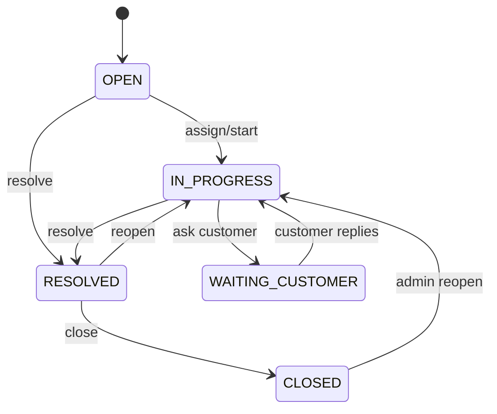
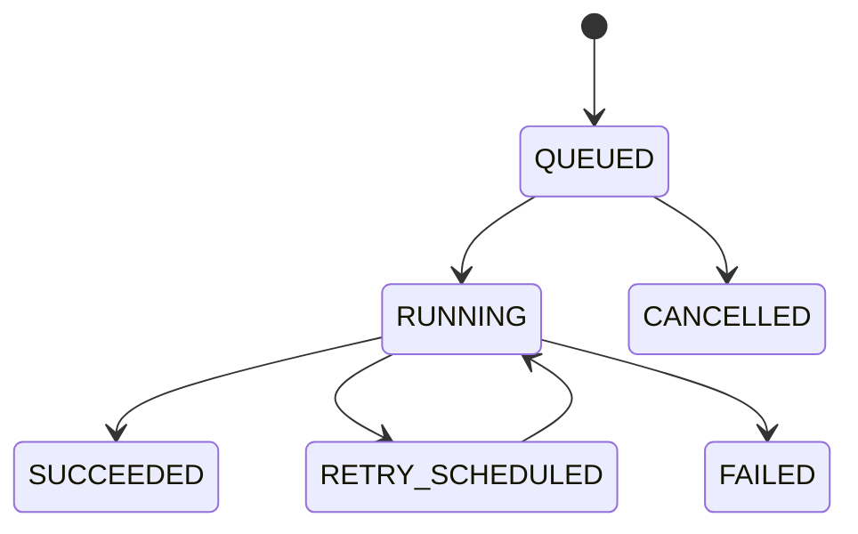

# Domain Model and Core Flows

## 1. Core aggregates

### Ticket aggregate

Fields: `id`, `tenantId`, `number`, `requesterId`, `assigneeId`, `subject`, `description`, `category`, `priority`, `status`, `version`, timestamps.

Invariants:

- Requester, ticket and assignee belong to the same tenant.
- Only Support Agent or Admin may assign tickets.
- Closed tickets are immutable except for reopen and audit metadata.
- Status commands require optimistic-lock version.
- AI can suggest category/priority but cannot directly mutate accepted values.

### Knowledge document aggregate

Fields: `id`, `tenantId`, `title`, `sourceKey`, `mimeType`, `checksum`, `status`, `visibility`, timestamps.

Invariants:

- Only Admin may upload or publish.
- Only `ACTIVE` documents participate in retrieval.
- A new checksum version invalidates prior chunks after successful replacement ingestion.
- Deleted documents are removed from retrieval immediately and physically purged asynchronously.

### AI job aggregate

Fields: `id`, `tenantId`, `jobType`, `subjectType`, `subjectId`, `inputHash`, `status`, `promptVersion`, `model`, `attemptCount`, usage, timestamps.

Invariants:

- `(tenantId, jobType, subjectId, inputHash)` is logically idempotent.
- Terminal jobs are `SUCCEEDED`, `FAILED`, `CANCELLED` or `REJECTED`.
- Output must validate against the job-type schema before success.

## 2. Ticket state machine

Invalid transitions return `409 TICKET_INVALID_TRANSITION`.

## 3. AI job state machine

## 4. Create ticket and async analysis

1. Client sends `POST /v1/tickets` with `Idempotency-Key`.
2. Ticket Service validates tenant/user, creates ticket and `TicketCreated` outbox event in one transaction.
3. API returns `201` without waiting for AI.
4. Outbox publisher sends `ticket.created.v1`.
5. AI Worker claims event and calls AI Orchestrator create/execute job.
6. Orchestrator calls model with structured schema.
7. Orchestrator publishes `ai.analysis.completed.v1` or `ai.analysis.failed.v1`.
8. Ticket Service idempotently projects the result.
9. UI receives updated state on polling; WebSocket/SSE is a later enhancement.

## 5. Draft grounded reply

1. Agent sends `POST /v1/tickets/{id}/ai-drafts`.
2. Ticket Service verifies role and ticket access, creates command/outbox event and returns `202` with job ID.
3. Worker requests Orchestrator to execute `DRAFT_REPLY`.
4. Orchestrator calls Knowledge Search with tenant, agent identity, query and topK.
5. Knowledge Service filters by tenant/ACL before vector search.
6. Orchestrator provides retrieved chunks to model and requires citation IDs in structured output.
7. Citation IDs are validated against retrieved chunks. Unknown citations reject the output.
8. Completed event is projected into Ticket Service.
9. Agent edits/approves draft. A separate normal comment command sends it; AI cannot send directly.

## 6. Upload and ingest document

1. Admin requests upload URL.
2. Knowledge Service creates `UPLOADING` document and signed URL.
3. Client uploads directly to object storage.
4. Client completes upload with checksum and size.
5. Service verifies object metadata, sets `QUEUED` and publishes ingest event.
6. Worker extracts text, normalizes, splits chunks, creates embeddings and stores a new document version.
7. One transaction activates the new version and deactivates the old version.
8. `knowledge.document.activated.v1` is published.

## 7. Failure behavior

| Failure | User-visible behavior | Recovery |
|---|---|---|
| Model timeout | Ticket remains usable; AI status shows delayed | retry, then DLQ/manual retry |
| Knowledge timeout | Draft job retries; no ungrounded fallback | one REST retry, job retry |
| Invalid model JSON | output rejected and retried once with repair instruction | terminal failure after retry |
| Duplicate event | no duplicate change | processed-event unique key |
| Object upload incomplete | document remains `UPLOADING` then expires | cleanup after 24 hours |
| Embedding partial failure | version never activated | delete staging chunks and retry |

