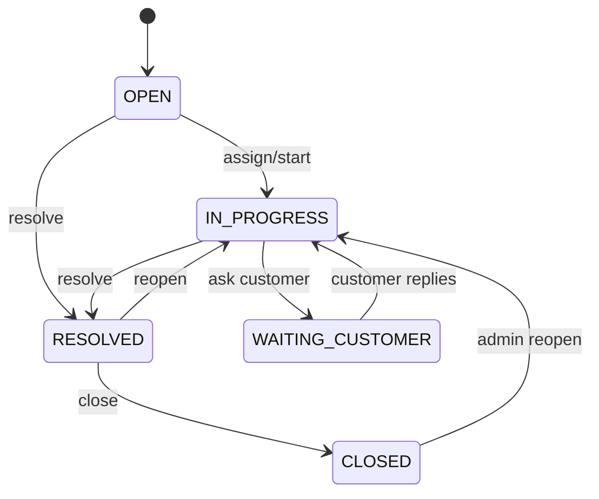
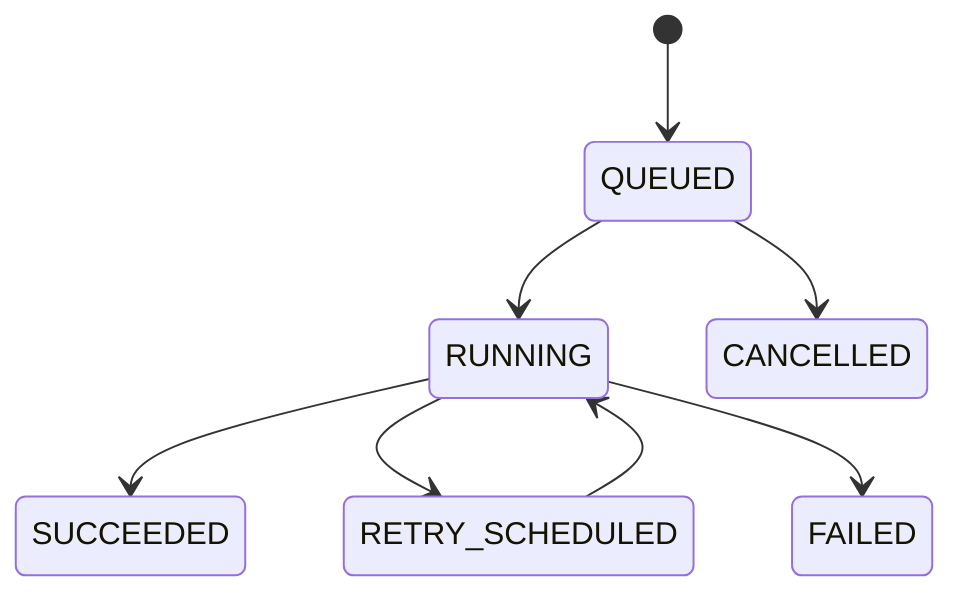

# Domain model và các luồng chính

## 1. Các aggregate chính

### Ticket aggregate

Các field: `id`, `tenantId`, `number`, `requesterId`, `assigneeId`, `subject`, `description`,
`category`, `priority`, `status`, `version` và timestamp.

Các bất biến:

- Requester, ticket và assignee phải thuộc cùng tenant.
- Chỉ Support Agent hoặc Admin được assign ticket.
- Ticket đã đóng không được sửa, ngoại trừ reopen và audit metadata.
- Lệnh đổi trạng thái phải kèm optimistic-lock version.
- AI chỉ được đề xuất category/priority, không được trực tiếp thay đổi giá trị đã chấp nhận.

### Knowledge document aggregate

Các field: `id`, `tenantId`, `title`, `sourceKey`, `mimeType`, `checksum`, `status`, `visibility` và
timestamp.

Các bất biến:

- Chỉ Admin được upload hoặc publish.
- Chỉ tài liệu `ACTIVE` được dùng khi retrieval.
- Phiên bản checksum mới chỉ vô hiệu hóa chunk cũ sau khi ingest thay thế thành công.
- Tài liệu bị xóa phải biến mất khỏi retrieval ngay và được xóa vật lý bất đồng bộ.

### AI job aggregate

Các field: `id`, `tenantId`, `jobType`, `subjectType`, `subjectId`, `inputHash`, `status`,
`promptVersion`, `model`, `attemptCount`, usage và timestamp.

Các bất biến:

- `(tenantId, jobType, subjectId, inputHash)` có tính idempotent về mặt logic.
- Trạng thái kết thúc gồm `SUCCEEDED`, `FAILED`, `CANCELLED` hoặc `REJECTED`.
- Output phải hợp lệ theo schema của job type trước khi job thành công.

## 2. State machine của ticket

```mermaid
stateDiagram-v2
  [*] --> OPEN
  OPEN --> IN_PROGRESS: assign/start
  OPEN --> RESOLVED: resolve
  IN_PROGRESS --> WAITING_CUSTOMER: ask customer
  WAITING_CUSTOMER --> IN_PROGRESS: customer replies
  IN_PROGRESS --> RESOLVED: resolve
  RESOLVED --> CLOSED: close
  RESOLVED --> IN_PROGRESS: reopen
  CLOSED --> IN_PROGRESS: admin reopen
```

Transition không hợp lệ trả `409 TICKET_INVALID_TRANSITION`.

## 3. State machine của AI job

```mermaid
stateDiagram-v2
  [*] --> QUEUED
  QUEUED --> RUNNING
  RUNNING --> SUCCEEDED
  RUNNING --> RETRY_SCHEDULED
  RETRY_SCHEDULED --> RUNNING
  RUNNING --> FAILED
  QUEUED --> CANCELLED
```

## 4. Tạo ticket và phân tích bất đồng bộ

1. Client gửi `POST /v1/tickets` kèm `Idempotency-Key`.
2. Ticket Service xác minh tenant/user, tạo ticket và event `TicketCreated` trong cùng transaction.
3. API trả `201` mà không chờ AI.
4. Outbox publisher phát `ticket.created.v1`.
5. AI Worker nhận event và yêu cầu AI Orchestrator tạo/thực thi job.
6. Orchestrator gọi model với structured schema.
7. Orchestrator phát `ai.analysis.completed.v1` hoặc `ai.analysis.failed.v1`.
8. Ticket Service chiếu kết quả theo cách idempotent.
9. UI nhận trạng thái mới bằng polling; WebSocket/SSE là cải tiến sau này.

## 5. Soạn câu trả lời có căn cứ

1. Agent gửi `POST /v1/tickets/{id}/ai-drafts`.
2. Ticket Service kiểm tra role và quyền truy cập, tạo command/outbox event rồi trả `202` kèm job ID.
3. Worker yêu cầu Orchestrator thực thi `DRAFT_REPLY`.
4. Orchestrator gọi Knowledge Search với tenant, danh tính agent, query và topK.
5. Knowledge Service lọc tenant/ACL trước vector search.
6. Orchestrator đưa các chunk tìm được vào model và yêu cầu citation ID trong structured output.
7. Citation ID được đối chiếu với chunk đã lấy; citation lạ khiến output bị từ chối.
8. Completed event được chiếu vào Ticket Service.
9. Agent sửa/duyệt draft rồi gửi bằng lệnh comment bình thường; AI không được tự gửi.

## 6. Upload và ingest tài liệu

1. Admin yêu cầu upload URL.
2. Knowledge Service tạo document `UPLOADING` và signed URL.
3. Client upload trực tiếp lên object storage.
4. Client hoàn tất upload với checksum và kích thước.
5. Service xác minh object metadata, chuyển `QUEUED` và phát ingest event.
6. Worker trích xuất, chuẩn hóa, chia chunk, tạo embedding và lưu document version mới.
7. Một transaction kích hoạt version mới và vô hiệu version cũ.
8. `knowledge.document.activated.v1` được phát.

## 7. Hành vi khi lỗi

| Lỗi | Biểu hiện với người dùng | Khôi phục |
|---|---|---|
| Model timeout | Ticket vẫn dùng được; trạng thái AI báo chậm | retry, sau đó DLQ/manual retry |
| Knowledge timeout | Draft job retry; không fallback sang nội dung thiếu căn cứ | một lần REST retry, rồi job retry |
| JSON từ model không hợp lệ | Output bị từ chối và retry một lần với repair instruction | thất bại cuối sau retry |
| Event trùng | Không tạo thay đổi trùng | unique key của processed-event |
| Upload chưa hoàn tất | Document giữ `UPLOADING` rồi hết hạn | dọn sau 24 giờ |
| Một phần embedding thất bại | Version không được kích hoạt | xóa staging chunk và retry |
